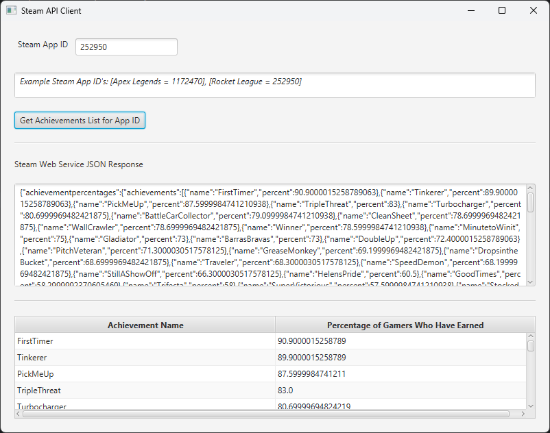

# Steam-API-Client-Java-Example
An example Java application for accessing the Steam Web API

## Requirements

* JavaFX
* Java 11+

## Description
A simple JavaFX application that uses the Java HttpClient (Java 11+) to call the Steam Web Service API to download and display a list of achievements for a provided App ID.

Both the raw JSON response message body as well as a table of parsed results are displayed.

## Related Documentation

* Steam Web API Documentation: https://steamcommunity.com/dev
* SteamDB (for looking up App ID's of games): https://steamdb.info/